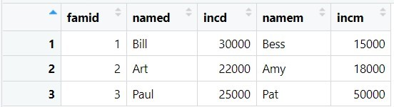
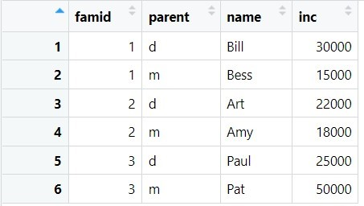
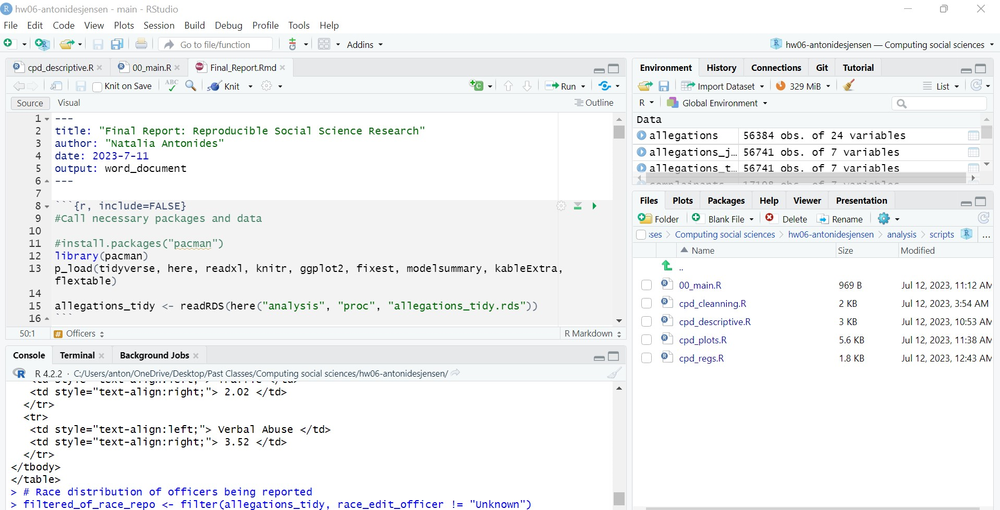
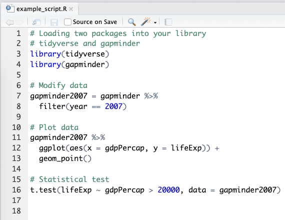

```{r setup, include=FALSE}
#default: do not show code
knitr::opts_chunk$set(echo = TRUE)

#function for changing text size
knitr::knit_hooks$set(mysize = function(before, options, envir) {
  if (before) 
    return(options$size)
})

#set console output to 50 characters so it fits on slide
options("width" = 50, tibble.print_min = 4)
library(tidyverse)
```

# The Powers of R: Data cleaning

Clean data so it is easy to process and analyse. For example, we can tidy data frames: 

```{r, echo=FALSE}

```

```{r, echo=FALSE}

```

# The Powers of R: Data Analysis - Causal and Descriptive 

Descriptive Statistics: 

* summary(): Generates summary statistics for numeric data.
* table(): Creates frequency tables for categorical data.
* mean(), median(), sd(): Calculate mean, median, and standard deviation of a numeric vector.
* cor(): Calculate correlation between variables.

Causal Analysis:

* lm(): Fit linear regression models to explore relationships between variables.
* glm(): Fit generalized linear models for non-linear relationships.
* causalImpact(): A package to estimate causal effects using Bayesian structural time-series models.
* matching(): A package for propensity score matching to estimate causal effects in observational data.


# The Powers of R: Data Visualization 

R allow you to create a wide range of visualization to display your data. Following are some example graphs made with R: 
```{r, out.width="75%", out.height="75%", echo=FALSE}
knitr::include_graphics("images/example_graphs.png")
```


# Benefits of R
* Relatively low barrier to entry/easy to learn
* Designed for statistics and visualization, while Python and other languages are designed for programming and data engineering, mostly used in data science/public sector/nonprofits/finance
* Beautiful data visualization packages 
* Open source/free for all users
* Large community of users, many resources for learning


# R vs R Studio 

R: Programming language and software environment specifically designed for statistical computing and graphics. 

R Studio: Integrated development environment (IDE) for R. 

* It is not a separate programming language but rather an application that makes working with R more convenient and user-friendly. 

```{r, out.width="75%", out.height="50%", echo=FALSE}

```

# Rstudio Integrated Development Environment Panes

* Editor
* Console
* Environment, History
* Files, Plots, Help 

```{r, out.width="85%", out.height="60%", echo=FALSE}

```

# Types of R Files 
R Script:

* A plain text file with a .R extension containing R code.
* Designed for writing and executing R code in a linear manner.
* Used for general R programming tasks, data analysis, model building, etc.
* Lacks built-in support for formatting or documentation.
* Produces output in the R console.

R Markdown

* A hybrid of Markdown and R code: integration of text, code, and output.
* Allows you to mix explanatory text, headings, lists, images, equations, and R code chunks.
* Offers the ability to "knit" the document into various output formats like HTML, PDF, Word, slides, etc.
Ideal for reproducible research and sharing data analyses

# R Scripts Files

```{r, out.width="100%", out.height="100%", echo=FALSE}

```

# R Markdown Files 

Components

* A YAML header surrounded by --- at the top of the file
* Text mixed with simple text formatting using the Markdown syntax
* Chunks of R code surrounded by ``` 

```{r, echo=FALSE, out.width="85%", out.height="60%"}
knitr::include_graphics("images/rm_example.png")
```

# Rstudio Shortcuts 

* Cmd/Ctrl + Enter runs selected line
* Cmd/Ctrl + Enter + S runs whole script
* Up arrow scrolls through history
* Cmd/Ctrl + S saves script
* Cmd/Ctrl + Shift + K knits
* Cmd/Ctrl + Alt + I inserts code chunk 

# Data Types 
Numeric

* Stores real numbers (both integers and decimals)
* NOT surrounded by quotation marks 

Character

* Similar to strings in other languages
* Surrounded by quotation marks. 
* Useful to include words / phrases / sentences

Logical 

* You can either write T, F, TRUE or FALSE (No quotation marks)
* Where R expects a logical value, 0 will be treated as FALSE and 1 will be treated as TRUE

# Data Types: Examples

NOTE: To assign a value/object to a variable we use "<-"

```{r}
# Numeric vector
numeric_vector <- c(1, 2, 3, 4, 5)

# Character vector
character_vector <- c("apple", "banana", "pear")

# Logical vector
logical_vector <- c(TRUE, FALSE, TRUE, TRUE)
```

# Operators: Arithmatic 
```{r, eval=FALSE}
#Addition: +
10+5

#Subtraction: -
10-5

#Multiplication: *
10/5

#Exponent: ^
10^5

# Remainder of division: %%
10%%5

# Interger division: %/%
10%/%5
```

# Operators: Relational 

* Less than: < 
* Greater than: > 
* Less than or equal to: <= 
* Grater than or equal to: >= 
* Equal to: == 

Example: 
```{r}
a <- 5
b <- 10

a < b

a <= b
```
# Operators: Logical 

* Logical NOT: !
* Logical AND: &&
* Logical OR: ||

Examples: 
```{r}
100 > 10 && 10 == 10 
10 > 50 && 10 == 10
100 > 10 || 10 == 11 
```


# Object Types: Vectors 
One-dimensional arrays that can hold elements of the same data type (e.g., numbers, characters, logical values).

* created using c() function
```{r}
# Numeric vector
numeric_vector <- c(1, 2, 3, 4, 5)

# Character vector
character_vector <- c("apple", "banana", "pear")

# Logical vector
logical_vector <- c(TRUE, FALSE, TRUE, TRUE)
```

# Manipulating Vectors 
* Indexing allows us to select a subset of values stored in vectors or matrices
* Once indexed (selected) we can point to and work this these values 
* To index into an object, we type the object’s name and then []. Within the brackets you tell R which position(s) you would like to index into


shopping[1]: prints the first item 

shopping[1:5]: prints items 1 – 5 

shopping[c(1, 3, 5)]: prints items 1, 3, and 5

shopping[-2]: prints all the items except the second. 

shopping[1:3] <- c(“apple”, "pear", "mango"): goes into the 1st through 3rd elements of the shopping vector and rewrites their values to be the values found in the vector 


# Object Types: Lists 
One-dimensional collections that can contain elements of different data types, including other lists or objects.

* created using list() function 
```{r}
# List containing different data types
my_list <- list(1, "hello", TRUE, c(10, 20, 30))

# Nested list
nested_list <- list(name = "John", age = 30, 
                    contact = 
                      list(email = "john@example.com", 
                      phone = "123-456-7890"))
```

# Object Types: Dataframes 

* Two-dimensional data structures (tables or spreadsheets)
* They are organized in rows and columns, where each column represents a variable and each row represents an observation.
```{r}
#create data frame
df <- data.frame(
    name = c("Alice", "Bob", "Charlie"),
    age = c(25, 30, 28),
    gender = c("Female", "Male", "Male"))

#print data frame
print(df)
```


# Object Types: Matrix 
Matrices are two-dimensional arrays that contain elements of the same data type.

They are created using the matrix() function and have rows and columns.

* The “data =” input or argument is where we tell R what data you want to put in the matrix (in the form of a vector) 
* The “ncol =” and “nrow =”  arguments are where we tell R the number of rows and/or columns we want 
* The “byrow =” argument is where we put either TRUE or FALSE to tell R whether to fill the data in by row, or by column 

# Object Type: Matrix 
```{r}
# create matrix with byrow=TRUE
mat <- matrix(c(1, 2, 3, 4, 5, 6), 
              nrow = 2, ncol = 3, byrow=TRUE)
mat

#create matrix with byrow=FALSE
mat2 <- matrix(c(1, 2, 3, 4, 5, 6), 
               nrow = 2, ncol = 3, byrow=FALSE)
mat2
```

# Manipulating Matrices 

Because matrices are 2D, we have to tell R which positions we want to index into in terms of rows and columns. 

* To index into a matrix, we type the matrix’s name and then [], for which [row, column]

myMatrix[2,1]: prints the element in the 2nd row, 1st column 

myMatrix [1,1:2]: prints the elements in the 1st row, and 1st and 2nd columns 

myMatrix [,3] <- c(10, 11): silently sets the 3rd column values equal to 10 and 11 